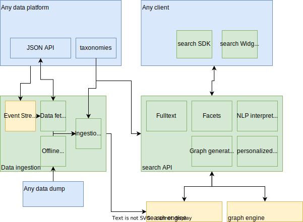

# Explain Architecture

Refer to the [introduction](./introduction.md) to get main components.

This image illustrates the main components and their interactions.

 ([source](../assets/architecture-diagram.drawio))

The main idea is to have:
* a very good stack with best in class open source components (see docker compose files)
* a very powerful API that is capable and easy to use.
  This is achieved through the use of Lucene Query Language and abstracting some complex processing under the hood (synonyms, language support, aggregations, etc.)
* a single, easy to use configuration file to declare your data structure and what you need to search
* web components to quickly build UI's while still being able to customize it in many scenarios.

## Archive

The initial [Search-a-licious roadmap architecture notes](https://docs.google.com/document/d/1mibE8nACcmen6paSrqT9JQk5VbuvlFUXI1S93yHCK2I/edit) might be interesting to grasp the general idea of the project architecture.

