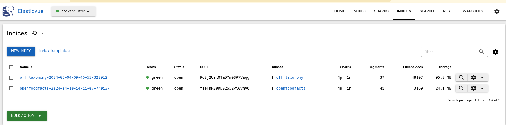

# Tutorial - Using search-a-licious in your project

So you have a dataset, or a project, with a collection of data you want to make searchable.
Search-a-licious can help you have it done in a matter of few hours, while retaining your choices.

In this tutorial, we will see how we can use search-a-licious to search Open Food Facts data.

## Setting up

### Clone the repository

As an easy way to setup the project we will clone the repository:

```bash
git clone git@github.com:openfoodfacts/search-a-licious.git
cd search-a-licious
```

### Create a configuration file

We need to create a configuration file to indicate which fields we care about in our index.

For this we can create a conf/data/openfoodfacts-tutorial.yml file. It uses the [YAML format](https://yaml.org/).

#### Default Index and Indices

At the top we have:

```yaml
default_index: "off" # see 2
indices:  # see 1
  off:    # see 2
```

1. Search-a-licious support serving more than one dataset at once,
  each dataset as it's own indice with it's own definition.
  So we start with the "indices" keyword.

2. We must give a name to our unique index. Let's call it `off` as Open Food Facts.
  We also indicate that this is the default index for the API.

#### Index Configuration

Now comes important indications for the index:
```yaml
...
indices:
  off:
    index:  # see 1
      id_field_name: code  # see 2
      last_modified_field_name: last_modified_t  # see 2
      name: openfoodfacts  # see 3
```

1. The index section mark settings that are specific to the index.
2. We have to then indicate two important fields:
   * a field that contains a unique id for each item in the collection (the identifier).
     In Open Food Facts dataset, it's simply the barcode, stored in `code`
    * a field that contains the item modification date to enable incremental updates.
      In Open Food Facts dataset, it's `last_modified_t`
3. We have to give a sensible name to the index, which should be unique for our ElasticSearch instance.
   So we simply put "openfoodfacts".

#### Configuring Searchable Fields

Let's continue with configuration of fields we want to be able to search.

```yaml
...
indices:
  off:
    ...
    fields:  # see 1
      code:  # see 2
        required: true
        type: keyword
      product_name:  # see 3
        full_text_search: true
        type: text_lang
      labels_tags:  # see 4
        type: keyword
        taxonomy_name: label
        bucket_agg: true
      labels:  # see 5
        full_text_search: true
        input_field: labels_tags
        taxonomy_name: label
        type: taxonomy
      nutriscore_grade:  # see 6
        type: keyword
        bucket_agg: true
      last_modified_t:  # see 7
        type: date
```

1. now we are in the field section
2. code is our identifier, it contains the barcode
  * we mark it required for we should reject elements without it (it's certainly a bug)
  * Each field must have a type which indicates how to handle it.
  * For the code we choose the type `keyword` which means it's a fixed token.
3. product_name is also an important field.
  * this time we want to be able to search part of it,
    also it's a field that comes with different values for different languages,
    that's why we mark it as `type: textlang`
  * We also include this field in free text search,
    that's the `full_text_search: true` part.
4. `labels_tags` is a field that contains labels of the product in a canonical form.
  * This is a field supported by a taxonomy.
    Taxonomies gives translations and synonyms for terms of a specific field of interest.
    In this case this is the `label` taxonomy. We will see later on the configuration of taxonomies.
    This field will be useful to find all items matching a particular label in a precise way,
    using the label canonical form.
  * Also we plan to use the field for facets so we put the `bucket_agg: true` part.
5. The labels repeat information from `labels_tags`
   (hence the `input_field: labels_tags`)
   but is there to enrich the information of full text searches
   (`type: taxonomy`).
   With that, the full text search will take into account the translations and synonyms of labels.
6. Nutri-Score is a field with very basic values: "a", "b", ..., "e", "unknown" and "not-applicable",
  as for code, a perfect case for a `keyword` field
7. last_modified_t, corresponding to last modification time, is an example of a date field.

#### Configuring Taxonomies
Let's continue with configuration of taxonomies.

Taxonomies will be used in multiple ways by *search-a-licious*:
* to add synonyms for taxonomized values on full text search.
  For example you might search for *"European Organic"*,
  to find items with the *"EU Organic"* label.
* to suggest values to search for in autocomplete (this can also be used in edit forms)
* to translate values from the results, for example as we display facets

```yaml
...
indices:
  off:
    ...
    taxonomy:
      sources:  # see 1
      - name: label
        url: https://static.openfoodfacts.org/data/taxonomies/labels.full.json
      exported_langs:   # see 2
      - en
      - fr
      index:   # see 3
        name: off_taxonomy
```

1. We cited one taxonomy above: `label`, here we define how to get it.
2. We must also defined which languages we want to use for this taxonomy.
   There is some trade-off between having a manageable size for the index and supporting more languages.
3. finally we have to give a name to the Elasticsearch index that will contain the taxonomies.

#### Configuring Supported Languages

We continue with languages configurations:

```yaml
...
...
indices:
  off:
    ...
    supported_langs: ["en", "fr"]
    lang_separator: "_"
```
1. the list of supported languages tells which languages will be retained in our index
2. the "lang separator" helps us tells that, the fields are suffixed by the language using this separator.
  In our case it means, for example, that `product_name_fr` contains the french version of `product_name`.

We have our configuration ready. That was a bit though, but this was the hardest part !

Don't hesitate to read the [Reference for Configuration file](./ref-config.md) to learn more.

### Setup the project

In the project you can modify the `.env` file and change variables you need to change,
but for now, the only mandatory variable to change
is the one that will point to our configuration file.

```ini
...
# Path to the yaml configuration file
# This envvar is **required**
CONFIG_PATH=`data/config/openfoodfacts.yml`
```

See the [Reference for Settings](./ref-settings.md) to learn about other settings.


## Initial import

### Getting the data

Now that it's all done, we are ready to start to import the data.

First we start the Elasticsearch index,
we will also start the ElasticVue service to be able to look at what happens:
```bash
docker compose up -d es01 es02 elasticvue
```

There is an export of all the openfoodfacts data in JSONL available on at 
https://static.openfoodfacts.org/data . But it's a very big file ! 
For this tutorial we will prefer to use a sample of products
at https://static.openfoodfacts.org/data/exports/products.random-modulo-10000.jsonl.gz

Put this file in the data/ directory which is bind mounted in the container.
On linux we can do it with:
```bash
wget https://static.openfoodfacts.org/data/exports/products.random-modulo-10000.jsonl.gz -O data/products.random-modulo-10000.jsonl.gz
```

### Import the data

We will then import this file in our index, we have a specific command for that:

```bash
docker compose run --rm api python3 -m app import /opt/search/data/products.random-modulo-10000.jsonl --skip-updates
```

The first part is simply to run a command using our docker container.
The `python3 -m app import` part is to run the `import` command provided by our `app` module.

We use the `--skip-updates` flag because we don't have a redis stream to connect to, to look for updates.

We also need our taxonomy, and there is a command `import-taxonomies` to get it.

```bash
docker compose run --rm api python3 -m app import-taxonomies
```

You can read more about this process reading [How to update index documentation](./how-to-update-index.md#first-import).


### Inspecting Elasticsearch

We can take a look at what just happened by using ElasticVue, a simple but handy tool to inspect Elasticsearch.

Open http://127.0.0.1:8080 in your browser.

If it's the fist time, click "ADD ELASTICSEARCH CLUSTER" and use "No authorization",
cluster name: docker-cluster, uri: http://localhost:9200

Click on the button which says there are 3 indices.

You shall see two indices:
* one named `openfoodfacts-<date of initial import>` with alias `openfoodfacts`
* one named `off_taxonomy-<date of initial import>` with alias `off_taxonomy`
As you already guessed, the first contains our food products, and the second our taxonomies.



The "Lucene docs" column gives you an idea of the number of entries you have in each index.

You can click on an index to view it's content and have a feeling of what we just imported.

## Using the search API

### Starting the service

We don't have an interface to search at the moment, but we can use the API.

It would be perfectly ok to only deploy the interface,
maybe because you will call it from your own application either to provide search to your users,
or to implement a very specific feature which is based upon a search request.

Let's start our search-a-licious service:

```bash
docker compose up  es01 es02 api frontend
```

### Running our first query

We start the `api` container, which is the search-a-licious backend,
and the frontend as it is a nginx acting as a reverse proxy.

Now let's open http://127.0.0.1:8000/docs

You can see the documentation of the various API offered by search-a-licious service.

Let's concentrate on the *GET* `/search` service. We can test it using the *Try it out* button.

We can try a simple search of *fair trade* in the q parameter, we get 17 results.

Interesting fields in the JSON we receive includes:

* `hits` where we have the detail of each result.
  In each results we retrieve full information about an item, that's a lot of data.
  We might optimize this using the `fields` query parameter.
* `page`: the current returned page, `page_count` the number of pages, and `page_size` the number of results per page.
* `count` is the total number of items returned.
  `is_count_exact`, when false indicate that for performance reason, we did not compute the total number of results,
  but there are at least `count` results.

### Sorting results

As you get the results you might want them according to a particular order.
Say we search for *fair trade* and we want the results to be sorted by the nutriscore grade.

We simply repeat the above query with `q` = `fair trade` and `sort_by` = `nutriscore_grade`.

### Limiting fields

In the previous example, we might only be interested in the name of the product and it's Nutri-Score.
We can limit the fields return by using the `fields` parameter.
Here it would be `product_name,nutriscore_grade`

### Using filters

We may want to be more precise on our request. Now let's ask products which really have "fair-trade" label.

For this we will use our query field in a more advanced way.

We can use this value for the "q" field: `labels_tags:"en:fair-trade"`.
Using this we specify that we search for the key "en:fair-trade" in the value.[^using-quotes]

We may then want to restrict our search to fair trade products that also have the "EU organic" label.
For this we can use `labels_tags:("en:fair-trade" AND "en:eu-organic")`.

If we wanted products having one or the other `labels_tags:("en:fair-trade" OR "en:eu-organic")` would do.

We can also combine those filters with a search. Using `cocoa labels_tags:"en:fair-trade"`
will help find some fair trade cocoa.

You can find more about the search query syntax in [Explain Query Language](./explain-query-language.md)

[^using-quotes]: Note that we have to use "" around value here, because the value contains a ":" inside.`labels_tags:en:fair-trade`  would be interpreted as asking for a field named labels_tags.en 
having the value fair-trade.

### Getting facets

Remember in our configuration we added a `bucket_agg: true` on some fields.
This will enable us to get facets on those fields.

Let's go back to our API, and use `cocoa labels_tags:"en:fair-trade"` in the request,
and ask for facet `nutriscore_grade`.
We get a result with same fields as for previous searches, but we have a new `facets` fields.

It returns something like
```json
  "facets": {
    "nutriscore_grade": {
      "name": "nutriscore_grade",
      "items": [
        {
          "key": "e",
          "name": "e",
          "count": 3,
          "selected": false
        },
        {
          "key": "d",
          "name": "d",
          "count": 2,
          "selected": false
        }
      ],
      "count_error_margin": 0
    }
  }
```

As you can see we have the "nutriscore_grade" facet with two value: "e" and "d", and we got the document count for each value.

The `selected` field was deduced from an analysis of the request.
If we were to ask for the `labels_tags` facets with the same request,
the `en:fair-trade` label would be selected, as it is an active filter.
(note that it only works if you write the query in a specific way).

You can try and ask both facets by using `nutriscore_grade,labels_tags` as the facets parameter.

## Creating a search Page using web components

Now that we have played around with the API,
we might want to create a search page to let users do their own search in a visual way.

That's were Search-a-licious also got you covered.

Search-a-licious provides web components that let you build your search page easily.

### Building a search interface

Let's try it and create a static html page.
We won't care much about the "look and feel" for now, for sake of simplicity.

A simple way to serve the page, is to add a file in the `frontend/public` folder[^devmode]

Let's create a `tutorial.html` file with a very basic initial content:

```html
<!DOCTYPE html>
<html>
<head>
    <title>Search-a-licious tutorial</title>
    <!-- this makes the various searchalicious components available -->
    <script type="module" src="./search-a-licious.bundled.js"></script>
</head>
<body>
  <div id="search-bar">
  <!-- the search bar where you can add text -->
  <searchalicious-bar></searchalicious-bar>
  <!-- the button to launch the search -->
  <searchalicious-button></searchalicious-button>
  <!-- sorting -->
  <searchalicious-sort auto-refresh>
    <searchalicious-sort-field field="nutriscore_grade">Best nutriscore</searchalicious-sort-field>
    <searchalicious-sort-field field="-nutriscore_grade">Worst nutriscore</searchalicious-sort-field>
  </searchalicious-sort>
  </div>
  <div id="results">
  <!-- display of results -->
  <searchalicious-results>
    <!-- this define a template for results. We can use ${} expression with a result object containing result fields -->
    <template slot="result">
      <li>
        <a href="https://world.openfoodfacts.org/${result.code}">${result.product_name}</a>
        − Nutri-Score: ${result.nutriscore_grade}
      </li>
    </template>
  </searchalicious-results>
  <!-- a small display of the number of results -->
  <searchalicious-count></searchalicious-count>
  <!-- pagination -->
  <searchalicious-pages></searchalicious-pages>
  </div>
</body>
</html>
```

As you can see this is a big file but not so big for search page.

If you know html you should be able to read this quite easily. Let's focus on some elements:

* first of all we have to import the search-a-licious library to make it available.
  This is done through the classical `script` element (in `head`),
  but note the `type="module"` property.
* next we have the `searchalicious-bar` component. This is the central component.
  Not only will responsible for the input in the search bar,
  but it also centralize the search options.
* then we have the `searchalicious-button`, which, as you guessed, is just responsible to launch the search
  (hitting enter in the search bar also works, but it might be more evident for some users with a button)
* Sorting is a bit more complex, we have the `searchalicious-sort` component,
  and inside we added the options we want to offer for sorting.
  The `field` property takes the same value as you would put in the `sort_by` parameter of the search API,
  and the inner text will be displayed to the user.
* To display our results, we need the `serachalicious-results` component.
  Inside it we need to define a template, with the property `slot` set to `result`.
  In this template we can use simple variable interpolation
  as in a [javascript template literal](https://developer.mozilla.org/en-US/docs/Web/JavaScript/Reference/Template_literals),
  with the `result` variable containing one search result, as returned by the API.
  This will be used to display each results.
  As the results use a `<ul>` element, it's better to enclose your result in a `<li>`.
* The `searchalicious-count` component will simply display the number of results.
* Finally the `searchalicious-pages` component is there to display a list of pages.


[^devmode]: this only works right away if you are using the service in developer mode, which should be the case if you followed this tutorial. Of course in production, this might be served by your own servers.

### Trying our interface

Let's try to use it !

We can go to `http://localhost:8000/static/tutorial.html` and see our interface.

**FIXME** screen capture

We can type `fair trade` in the search bar, hit the search buttons and see results displayed.

**FIXME** screen capture

We can use the pages navigation to browse all results.

We can also type a more advanced search like `cocoa labels_tags:"en:fair-trade"`

You can also test that sorting by best or worst nutriscore is working just fine !

If you are curious, you can open the dev toolbar (F12),  go in the network tab, select to only view XHR requests (requests sent by javascript), and see how each search is using the search API.
